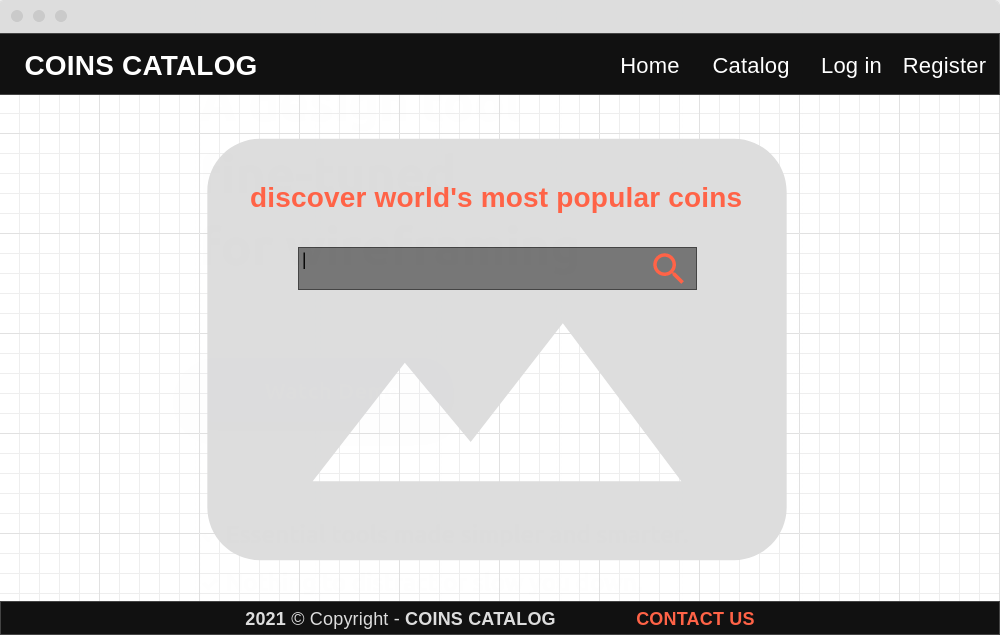
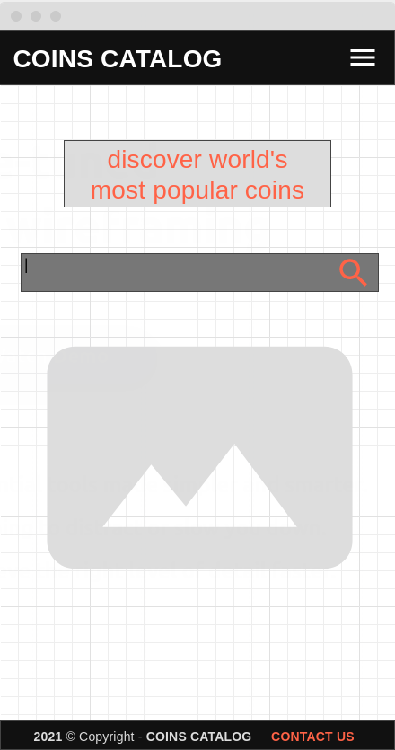
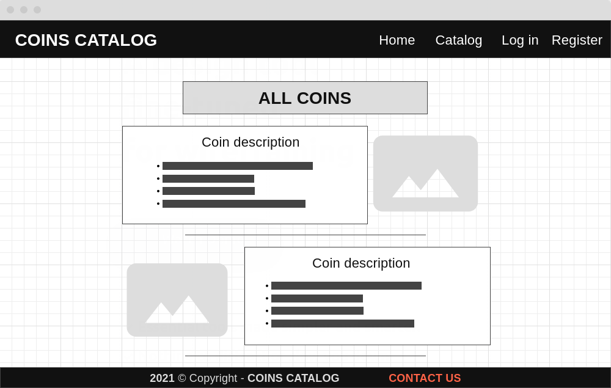
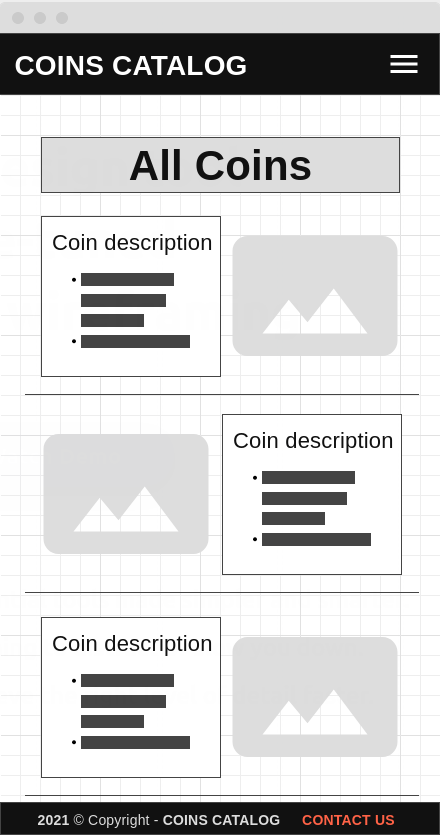
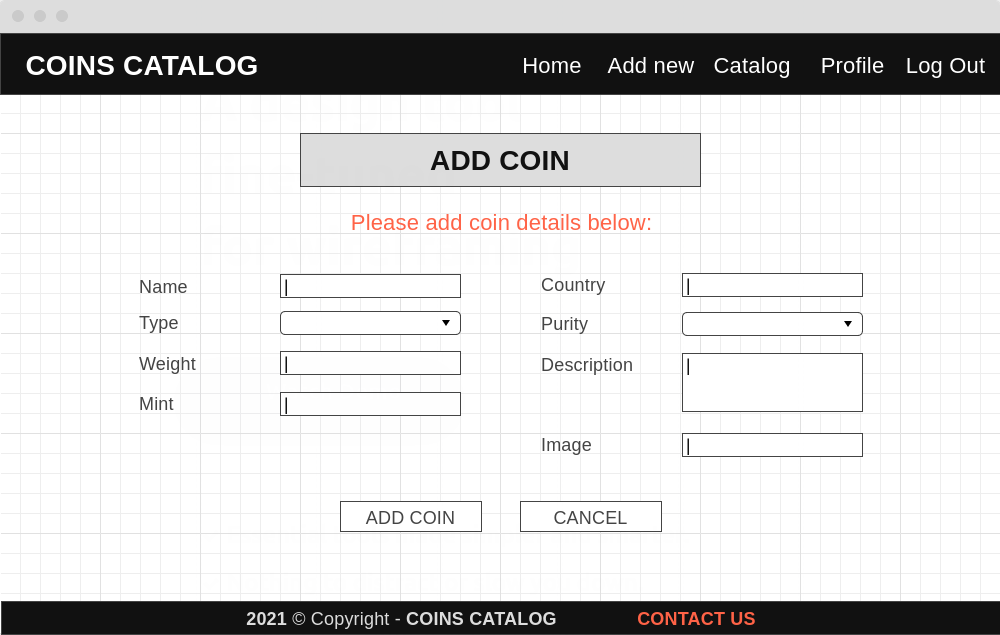
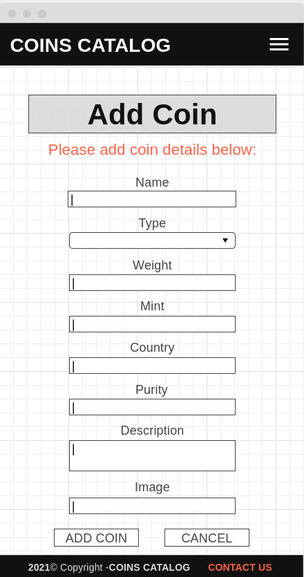
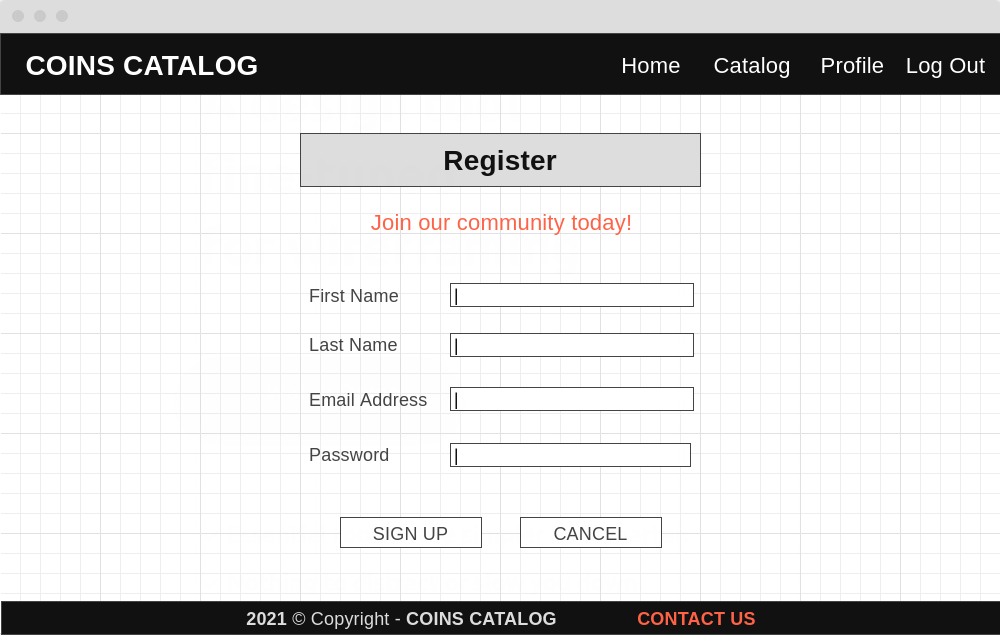
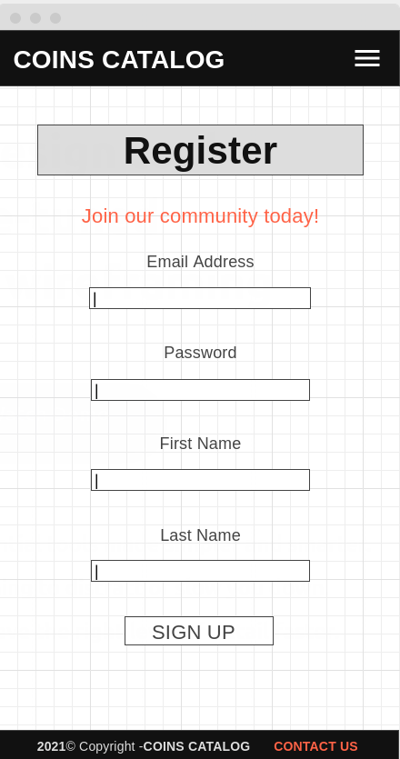
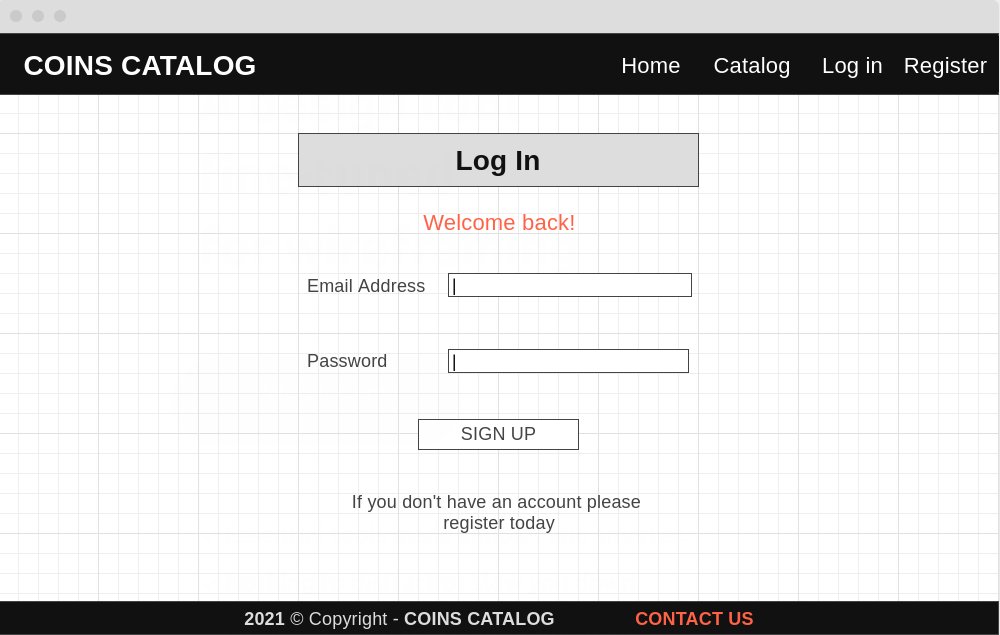
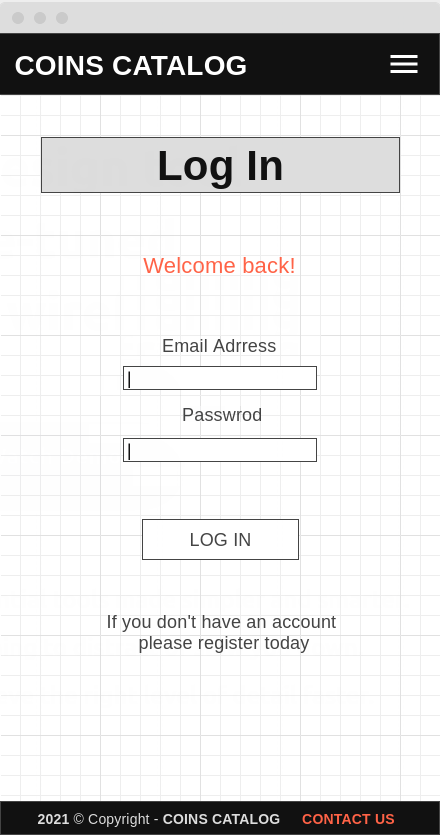

# Coins Catalog

## Data Centric Development Milestone Project.

Coins Catalog is a website where community can share their collections to other members and to the public. All users can search through dataset provided by a community members. Registered users can create, edit or delete their own dataset.

This project is for educational purposes only.

___
# Table of contents

- [UX](#ux)
    - [Strategy](#strategy)
    - [Scope](#scope)
        - [User stories](#user-stories)
    - [Structure of the website](#structure-of-the-website)
    - [Skeleton](#skeleton)
    - [Surface](#surface)
- [Features](#features)
- [Technologies used](#technologies-used)
- [Testing](#testing)
- [Deployment](#deployment)
- [Credits](#credits)
- [Screenshots](#screenshots)

___
# UX

## Strategy

The purpose of this project is to build a website that presents a catalog of bullion coins. Content is accessible for free for everyone and can be extended by registered members.

## Scope

A MVP (minimum viable product) includes:
- coins catalog
- landing page with a search option
- opportunity to create, edit and delete data by the user
- registration and login pages
- contact page

### User stories

As a new user:
- I would like to search coins catalog.
- I would like to be able to access all catalog data.
- I would like to register easily and login immediately after registration.

As a returning user:
- I would like to login and edit details on my account.
- I would like to add a new coin to the database.
- I would like to edit my coins data in a database.
- I would like to delete my coins data from a database.
- I would like to see a confirmation message on every action I take on the website.

As a site administrator:
- I would like to have a control of all data in the website database.
- I would like to have a control of all user profiles.

## Structure of the website

Website contains:
- fixed navigation bar or burger icon on mobile devices with essential links to navigate on the website
- a footer with contact option available all the time
- main content site which change on every action taken by a user.

## Skeleton

### Wireframes

- Landing Page

    

Desktop

    
    

    

Mobile

    
    
    

- All Coins Page

    

Desktop

    
    

    

Mobile

    
    
    

- All Coins Page

    

Desktop

    
    

    

Mobile

    
    
    

- Register Page

    

Desktop

    
    

    

Mobile

    
    
    

- Login Page

    

Desktop

    
    

    

Mobile

    
    
    

## Surface

___
# Features

___
# Technologies used

___
# Testing

___
# Deployment

___
# Credits

___
# Screenshots
