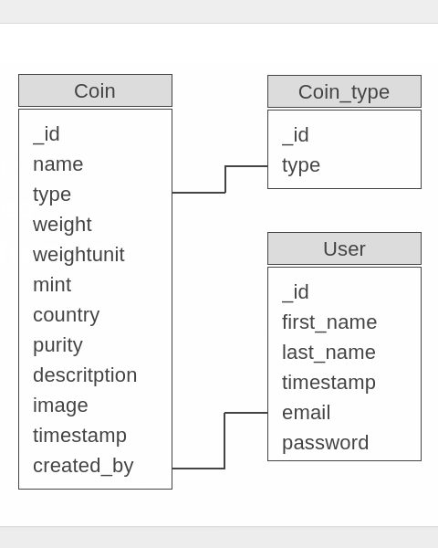
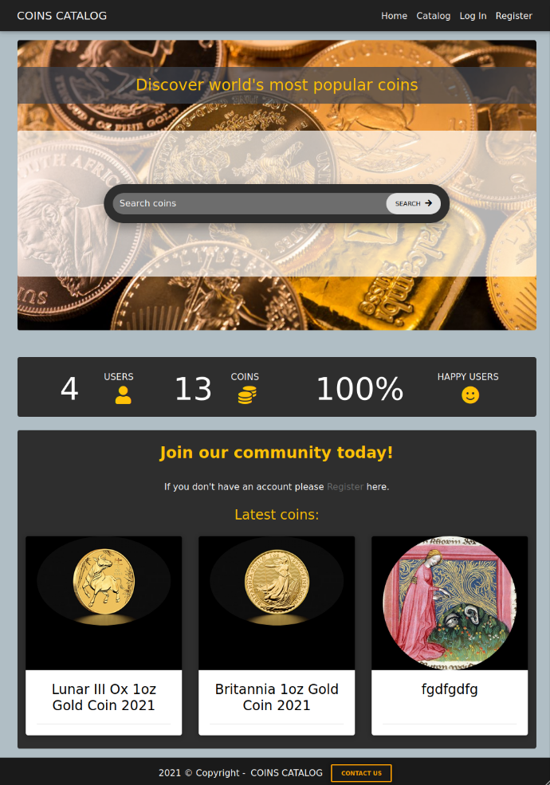
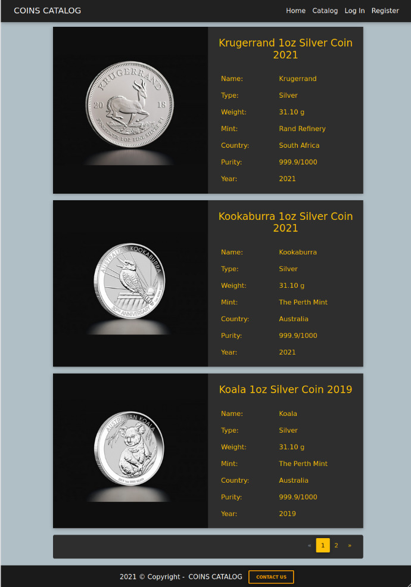
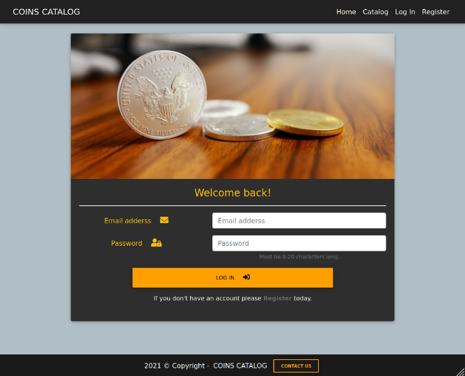
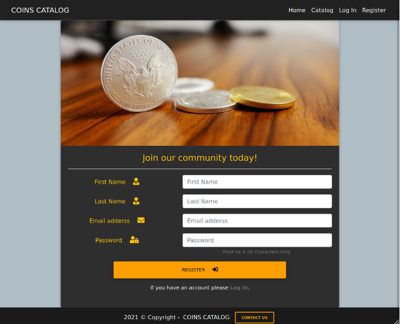
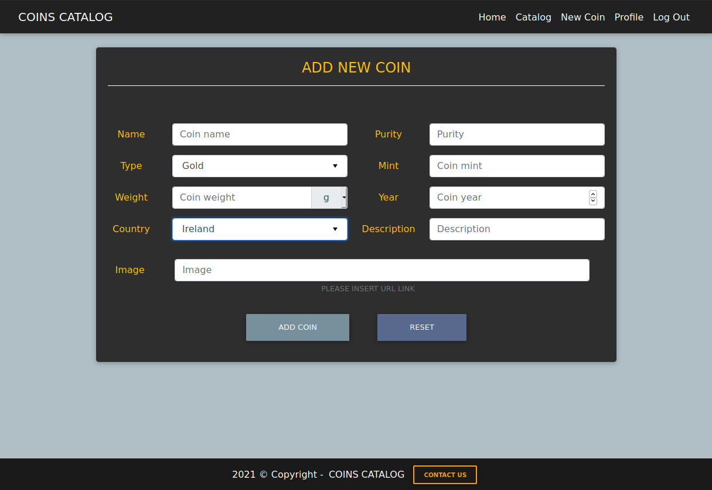
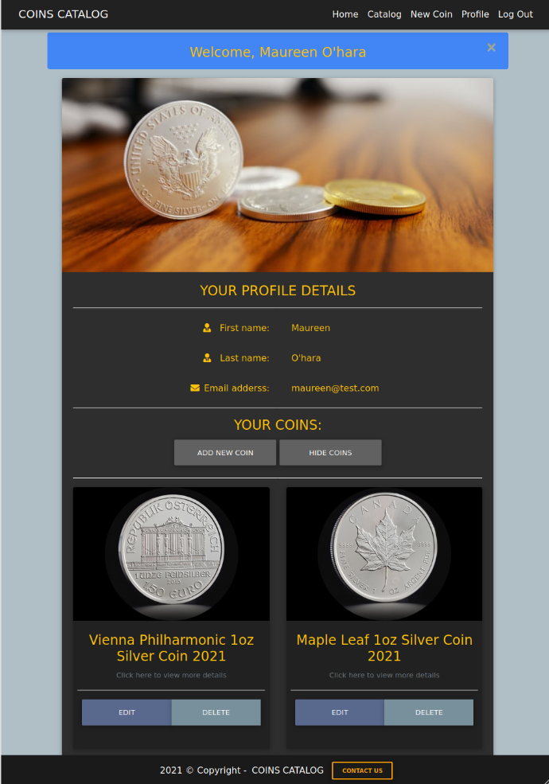
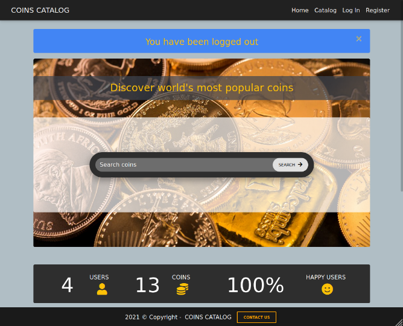

# Coins Catalog

## Data Centric Development Milestone Project.

Coins Catalog is a website where community can share their collections to other members and to the public. All users can search through dataset provided by a community members. Registered users can create, edit or delete their own dataset.

This project is for educational purposes only.

___
# Table of contents

- [UX](#ux)
    - [Strategy](#strategy)
    - [Scope](#scope)
        - [User stories](#user-stories)
    - [Structure of the website](#structure-of-the-website)
    - [Skeleton](#skeleton)
    - [Surface](#surface)
- [Features](#features)
- [Technologies used](#technologies-used)
- [Testing](#testing)
- [Deployment](#deployment)
- [Credits](#credits)
- [Screenshots](#screenshots)

___
# UX

## Strategy

The purpose of this project is to build a website that presents a catalog of bullion coins. Content is accessible for free for everyone and can be extended by registered members.

## Scope

A MVP (minimum viable product) includes:
- coins catalog
- landing page with a search option
- opportunity to create, edit and delete data by the user
- registration and login pages
- contact page

### User stories

As a new user:
- I would like to search coins catalog.
- I would like to be able to access all catalog data.
- I would like to register easily and login immediately after registration.

As a returning user:
- I would like to login and view details on my account.
- I would like to add a new coin to the database.
- I would like to edit my coin data in a database.
- I would like to delete my coin from a database.
- I would like to see a confirmation message on every action I take on the website.

As a site administrator:
- I would like to have a control of all data on the website database.
- I would like to have a control of all coin types.
- I would like to allow users to send a message to website administrator.

## Structure of the website

Website contains:
- fixed navigation bar or burger icon on mobile devices with essential links to navigate on the website
- a footer with contact option available all the time
- main content site which changes on every action taken by a user.

## Skeleton

### Wireframes

- Landing Page

    

Desktop

    
    

    

Mobile

    
    
    

- All Coins Page

    

Desktop

    
    

    

Mobile

    
    
    

- Add Coin Page

    

Desktop

    
    

    

Mobile

    
    
    

- Register Page

    

Desktop

    
    

    

Mobile

    
    
    

- Login Page

    

Desktop

    
    

    

Mobile

    
    
    

### Divergence final website look from wireframes

- Landing Page
    
    On landing page I decided to add 2 sections below search option:
        
    - A counter to display number of users registered on the website.
    - Join our community section for users that are not logged in.

- All Coins Page

    I decided to display images on the left hand side and description on the right hand side.
    This approach does not distract a user.

- Add Coin Page

    - Extra field for a year.
    - For a weight there is a drop down list for a weight unit.
    - For a country there is a drop down list available with fixed set of countries.
    - There is a Reset button instead of Cancel button.

- Register Page

    - There is a wide Register button instead of Sign up and Cancel buttons.
 
 - Login Page

    - Same as on the register page there is a wide Log in button instead of Sign in button.

### Database schema

Database contains 3 tables (collections):
- Coin
- Coin type
- User

The fields for each table can be found in the image below:

Database

## Surface

### Colors

Colours used in a project:
Purpose | Colour value
------------ | -------------
background | #b0bec5 
content background | #2e2e2e
flash messages background | #4285f4
main font | #ffc107
navigation and footer font | #ffffff
link | #696969
hoover | #ffc107
login, register, email button | #ffa000
profile button | #616161
edit button | #59698d
delete button | #78909c

### Fonts

* As a main font I used sans-serif.

### Images

I used images from:

*  [unsplash.com](https://www.unsplash.com) and it is credited in [credits](#credits) section.

*  [tavex.pl](https://www.tavex.pl) and it is credited in [credits](#credits) section.

[Back to Table of contents](#table-of-contents)
___
# Features

This project consist base.html page as a skeleton. It is divided into 4 parts:
- Header which contains navigation bar
- Section where flash messages are displayed
- Main section for all files other then base.html
- Footer with contact button

## Navigation bar

Navigation bar is located on the top of the website. It is responsive and changes to coins icon on mobile devices.
Brand logo is located in the top left corner. Links are in the right corner.

Users who are on the website for the first time and are not logged in can see following options: 
- Home
- Catalog
- Log in
- Register

For logged in users:
- Home
- Catalog
- New Coin
- Profile
- Log Out

For administrator who is logged in there are the same options as for a logged in user.
Additionally, there is an Admin options button available. It contains two links:
- Coin types
- Add new type

## Footer

Footer has a copyright information and contact us button.
After clicking the button user is redirected to contact us site.

## Sites

### Home

Site contains 3 sections:
- Search bar where user can search a coin by their name or description
- Counter with total number of users and total number of records in database
- Join our community which is displayed for unregistered users only

Home

### Catalog

Site displays all coins from database. I used pagination and it is at the bottom of the page. 

Catalog

### Log In

Here user can login to the account. After that site redirects user to the profile page.
Below the login button there is a link to register page.

Log In

### Register

Register is the place where user can create an account.
Login link is available below a Register button.

Register

### New Coin

On this site user can add a new coin. All fields has to be filled out.
Add coin button will validate a form and redirect user to the profile page.
Reset button reset all data in the form.

Add new coin

### Profile

User can see account details on the profile page.
User's coin collection can be displayed under show coins button.
Also Edit and Delete options are available here.

Profile

### Log Out

Log Out button will end a session and redirect user to the home page.

Log Out

___
# Technologies used

___
# Testing

___
# Deployment

___
# Credits

### Images:

* [unsplash-simon-zRxLgc-o56I.jpg](https://unsplash.com/photos/zRxLgc-o56I)

* All coins images are from [www.tavex.pl](https://www.tavex.pl) and are for educational use only.

___
# Screenshots
