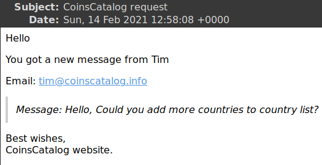
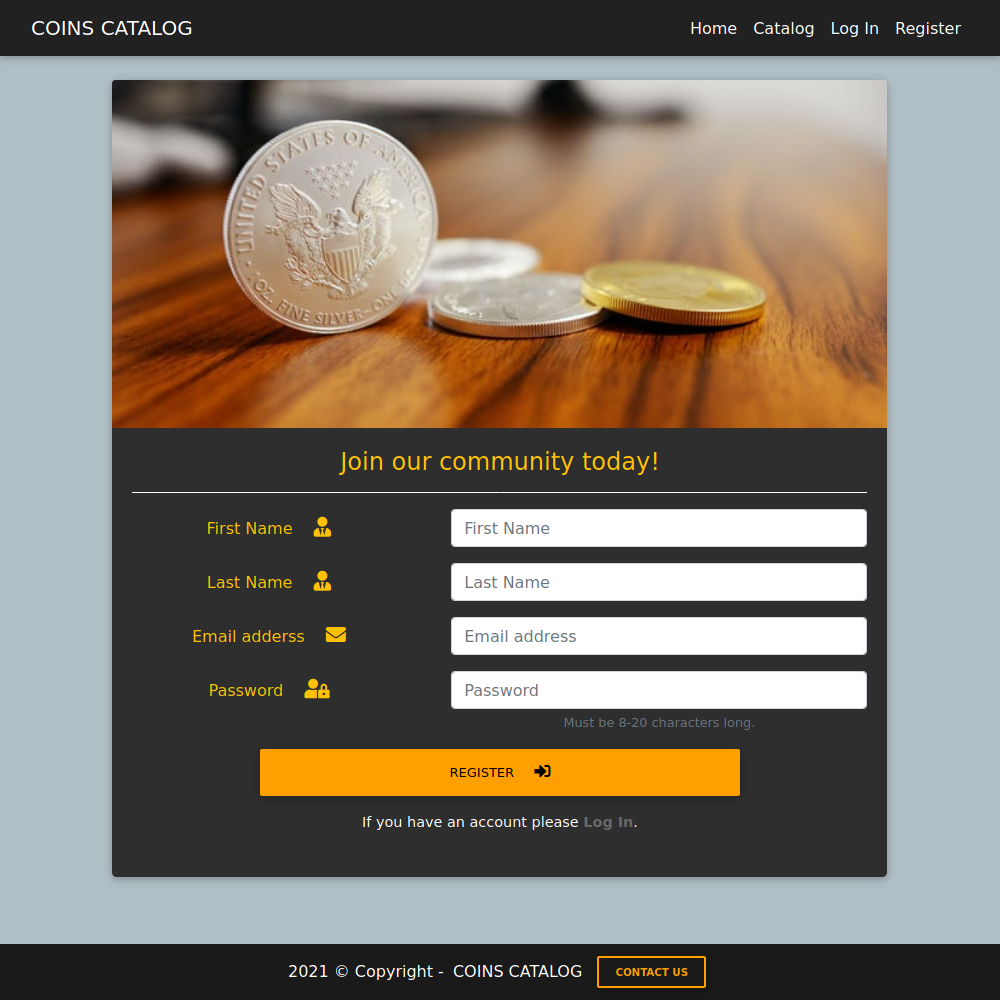
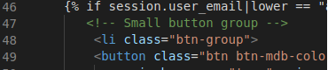
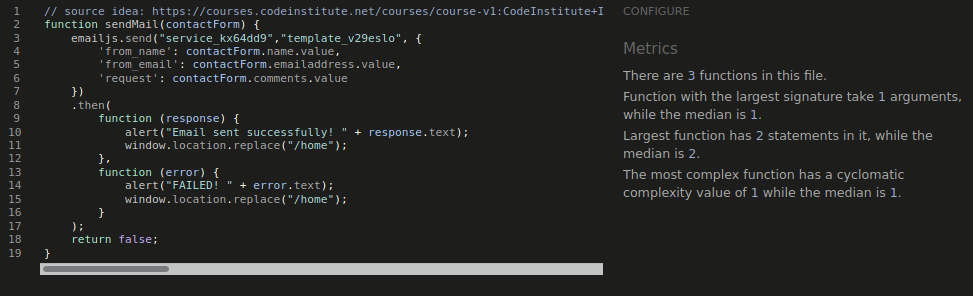

# Table of contents
- [Functionality testing](#functionality-testing)
- [Compatibility testing](#compatibility-testing)
- [User stories testing](#user-stories-testing)
- [Issues found during site development](#issues-found-during-site-development)
- [Performance testing](#performance-testing)
- [Code Validation](#code-validation)

## Functionality testing

I used Mozilla web developer tools and Chrome developer tools throughout the project for testing and solving problems with responsiveness and style issues.

### Landing Page 

Starting from the top of the page, I check:

* Navigation - first time user:
    - brand title - after clicking on the link page reloads.
    - Home - after clicking on the link page reloads.
    - Catalog - after clicking on the link page redirects to coins catalog.
    - Log in - after clicking on the link page redirects to log in page.
    - Register - after clicking on the link page redirects to register page.

* Navigation - logged in as a user:
    - New Coin - after clicking on the link page redirects to new coin page.
    - Profile - after clicking on the link page redirects to profile page.
    - Log out - after clicking on the link page redirects to home page.

* Navigation - logged in as an administrator:
    - Admin options button - after clicking drop down menu displays as expected
    - Coin Types - after clicking on the link page redirects to coin types page
    - Add new Type - after clicking on the link page redirects to add new type page

* Footer - Contact me button works and opens contact us page

### Landing Page - Search

* Search returns results from below fields from a database:
    - name
    - type
    - weight
    - weight unit
    - country
    - purity
    - mint
    - year
    - description

    Everything works as expected

    * For not logged in user search returns coin image and coin description as a link to register page.
    * For registered user search returns coin image and coin description. Description opens coin details.
    * For not recognized search, flash message displays: `No results, Please try again!`

* Coin counter works as expected

* For not registered user, Join our community today section works and displays all content.
Register link under a title works. Buttons on last 3 records from database work and redirect to register page.

### Catalog Page

Page displays 10 records from a database. Pagination links work as expected.
When logged in as an administrator `Edit` and `Delete` buttons are visible and work as expected.

### Log In Page

Form validation, `Log in` button and Register link work as expected.

### Register Page

Form validation, `Register` button and Log in link work as expected.

### New Coin Page

Form validation, `Add Coin` and `Reset` buttons work as expected.
Corresponding tooltips are displayed for: weight, purity and year.
Type, weight unit and country drop down list display as expected.

### Profile Page

`Add new coin`, `Show Coins` and `Hide Coins` buttons work as expected.
`Click here to view more details` opens coin details. `Edit` and `Delete` buttons work as expected.

#### Edit Coin Page

Page loads and displays all data correctly.
Form validation, tooltips, drop down list and `Update`, `Cancel` buttons work as expected.

### Admin options - Add new Type Page

`Add Type` and `Reset` buttons work as expected. 

### Admin options - Coin Types Page

`Edit` and `Delete` buttons work as expected.

#### Edit Coin Types Page

Page loads correctly. `Edit Type` and `Cancel` buttons work as expected.

### Contact Us Page

Page loads and displays user data correctly when logged in as a user or administrator. As a regular
Form validation and `Send a message` button work as expected. OK button redirects user to home page.

### Error pages

All unrecognized pages are always redirect to error page.

[Back to Table of contents](#table-of-contents)
___
## Compatibility testing

Site was tested across multiple virtual mobile devices and browsers.
I checked all supported devices in both Mozilla web developer tolls and Chrome developer tools.

All tests Passed for devices from 320px on Chrome developer tools and 340px on Mozilla web developer tolls.

I tested on hardware devices such as: Lenovo ideapad with Ubuntu and Windows OS's as a virtual machines,
Lenovo smartphone with Android 7, LG smartphone with Android 8, Google pixel 3 with Android 11. No issues found.

[Back to Table of contents](#table-of-contents)
___
## User stories testing

### As a new user:

- I would like to search coins catalog.
    >  Search bar is visible and available for all users on the landing page.

    

Search (click to view)

    
    

- I would like to be able to access all catalog data.
    > A link to catalog page is in a navigation bar. User is able to view all coins there.
    > Catalog page displays all data in a clear way.

    

Catalog (click to view)

    
    

- I would like to register easily and login immediately after registration.
    > User has couple of options to register on the page:
    > - First: 
    >   - link to `Register` page is in a navigation bar.
    > - Second: 
    >   - register link on landing page in `Join our community today!` section
    >   - a button visible on each photo in `Join our community today!` section
    > - Third: 
    >   - link to register page under `log in` button in `Log In` page.
    > 
    > After registration user is login automatically and redirect to the `Profile` page.

    

Register (click to view)

    
    

### As a returning user:
- I would like to login and view details on my account.
    >  Link to `Log In` page is in a navigation bar. User can login and view account details in `Profile` page.

    

Log In (click to view)

    
    

- I would like to add a new coin to the database.
    >  User can add a coin from a navigation bar or from the profile page.

    

Add new coin (click to view)

    
    

- I would like to edit my coin data in a database.
    >  User can edit a coin from it's profile page. `Show coins` button displays all user data and `Edit` button is available for each coin.

    

Edit coin (click to view)

    
    

- I would like to delete my coin from a database.
    >  User can delete a coin from it's profile page. `Show coins` button displays all user data and `Delete` button is available for each coin.

    

Delete coin (click to view)

    
    

- I would like to see a confirmation message on every action I take on the website.
    >  All messages are displayed on the top of the page, as a flash messages. Additionally a modal is used for all delete operations.

    

Message (click to view)

    
    

### As a site administrator:
- I would like to have a control of all data on the website database.
    >  Administrator can edit or delete all coin data. This option is available in `Catalog` page.
    

Administrator - Catalog (click to view)

    
    

- I would like to have a control of all coin types.
    >  Administrator can view, add, edit or delete coin types from `Admin options` button. This button is visible to administrator only.
    

Coin Types (click to view)

    
    
    

- I would like to allow users to send a message to website administrator.
    >  `Contact Us` button redirects users to Contact page. Users can send a message from there.
    

Contact Us (click to view)

    
    

[Back to Table of contents](#table-of-contents)
___
## Issues found during site development

During site development I found a lot of bugs. I always tried to fix them immediately.
Here are few trivial and more complex examples.

### Register form error

During the register form test I found an error.
The form allowed me to create an email without a domain name. As a test example I used: aa@aa

I had to change the pattern from

`pattern="^[A-Z0-9._%+-]+@[A-Z0-9.-]+\.[A-Z]{2,}${5,35}$"`

to

`pattern="^[a-zA-Z0-9._%+-]+@[a-zA-Z0-9.-]+\.[a-zA-Z]{2,63}$"`

After that fix, register form accepts expected pattern. The only problem was with a typo on email label and placeholder.
The slack user found the bug on peer-code-review channel.

### Html errors

I used [Nu Html Checker](https://validator.w3.org/nu/) to check HTML bugs.
It was hard to use because I have Jinja2 template language inside html file.

Bugs found and fixed:

`
` in Navigation

Even if everything is OK an error still appears.

### Search errors

Searching wasn't working properly and was confusing.

Fix in Python:

And in app.py file for search route:

The `x` is only visible in chrome browser for an input field with `type="search"`

I tried to fix it but it is hidden behind MDB CSS or JS file.

#### I leave it as unfixed bug.

### Other unfixed bugs:

#### Second letter in a surname is not capitalize.

#### Coins edited by administrator are saved as administrator collection in a database.

This should return back to database as a user collection.

#### Show coins button in profile page

For users without any data in a database, this button should be hidden or relevant message should be displayed in Flash messages.

[Back to Table of contents](#table-of-contents)
___
## Performance testing

I run Lighthouse tool to check performance of the website.
Performance results always vary and this is because of 3rd party images in mongodb database.

Performance (click to view)

Performance - images (click to view)

[Back to Table of contents](#table-of-contents)
___
## Code Validation

### Nu Html Checker to test HTML

### W3C CSS Validator to validate CSS

### Jshint to test JavaScript

### PEP8 online

#### Result: Pass

[Back to Table of contents](#table-of-contents)

#### Back to [README.md](https://github.com/marcin-kli/MP3)